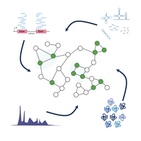

<!-- README.md is generated from README.Rmd. Please edit that file -->

```{r, include = FALSE}
knitr::opts_chunk$set(
  collapse = TRUE,
  comment = "#>",
  fig.path = "man/figures/README-",
  out.width = "100%"
)
```

# IntegraTRN 

<!-- badges: start -->
[](https://choosealicense.com/licenses/gpl-3.0/)

<!-- badges: end -->

The goal of IntegraTRN is to ...

## Installation

