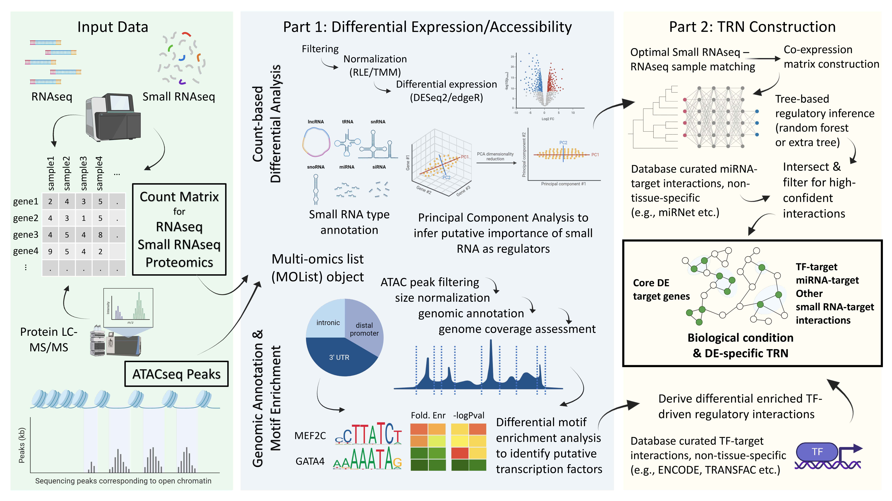

<!-- README.md is generated from README.Rmd. Please edit that file -->

```{r, include = FALSE}
knitr::opts_chunk$set(
  collapse = TRUE,
  comment = "#>",
  fig.path = "man/figures/README-",
  out.width = "100%"
)
```

# IntegraTRN

---

<!-- badges: start -->
[](https://choosealicense.com/licenses/gpl-3.0/)

[](https://lifecycle.r-lib.org/articles/stages.html#experimental)
<!-- badges: end -->

## Description

The R package `IntegraTRN` integrates transcriptomic, small RNAomic, proteomic, 
and epigenomic data to construct a transcriptional regulatory network (TRN) 
underlying the gene expression changes in a developmental or disease (or any 
continuous/binary) biological context. In particular, the TRN is a network of 
interacting factors, in which one element can exert a regulatory effect 
(activating or inhibitory) on the expression of one or more elements. Given the 
complex nature of transcriptional regulation, the package reveals the key 
players of such regulation, including transcriptional factors (TFs) and small 
RNAs. Since gene/protein expression changes are usually the most direct 
molecular cause of observed phenotypic alterations, the core TRN deciphers 
changes between two or more conditions and infers the upstream regulatory 
factors that mediate such changes. The analysis pipeline provided by this 
package is primarily composed of a two-step process: (1) elucidating the 
transcriptional and regulatory changes that take place during a biological 
process, such as development or disease; and (2) performing correlational 
analysis with rigorous filtering based on biological data to identify the 
regulatory interactions that are responsible for the observed changes.

The package is developed under the following environment:

- R version 4.3.1 (2023-06-16 ucrt)
- Platform: x86_64-w64-mingw32/x64 (64-bit)
- Running under: Windows 11 x64 (build 22621)

## Installation

To install the latest developmental version of the package:

```{r, eval=FALSE}
require("devtools")
devtools::install_github("j-y26/IntegraTRN", build_vignettes = TRUE)
library("IntegraTRN")
```

To run the shinyApp: `Under construction`

## Overview

```{r, eval=FALSE}
ls("package:IntegraTRN")
data(package = "IntegraTRN")
browseVignettes("IntegraTRN")
```

To get started, the functionality of the package is primarily divided into two
parts: (1) exploring differential expression or accessibility of genes and
proteins, and (2) constructing a small RNA - transcription factor - gene
regulatory network. The following is an overview of the functions in the
package, in the order of use subjected to the types of omcis data available.
`IntegraTRN` provides functions:

1. ***MOList*** for generating a `MOList` object that contains the omics data
   and sample grouping information
2. ***diffOmics*** for performing differential analysis on the omics data
3. ***annotateSmallRNA*** for annotating small RNA transcripts
4. ***plotVolcanoRNA*** for visualizing RNAseq differential expression
5. ***plotVolcanoSmallRNA*** for visualizing small RNAseq differential 
   expression
6. ***plotSmallRNAPCAs*** for visualizing small RNAseq principal component
   analysis for each type of small RNA
7. ***countPCA*** for general-purpose principal component analysis on count
   data
8. ***annotateATACPeaksMotif*** for annotating ATACseq peaks with motif
    enrichment analysis
9. ***plotATACAnno*** for visualizing the annotation of ATACseq peaks
10. ***plotATACCoverage*** for visualizing the coverage of ATACseq peaks
11. ***plotATACMotifHeatmap*** for visualizing the motif enrichment analysis
    as a heatmap comparing differentially enriched motifs between the two
    testing conditions
12. ***plotATACProfileHeatmap*** for visualizing the profile plot to see the
    distribution of peaks around the TSS
13. ***matchSamplesRNAsmallRNA*** for matching the samples between RNAseq and
    small RNAseq data
14. ***exportMatchResult*** for exporting the matching results to a data frame
15. ***loadExtInteractions*** for loading external interaction data for 
    small RNA - gene and TF - gene interactions
16. ***setOmicCutoffs*** for setting the cutoffs for differential expression
    and accessibility used to filter the key elements in the TRN
17. ***constructTRN*** for constructing the TRN
18. ***plotNetwork*** for visualizing the TRN
19. ***parseVertexMetadata*** for parsing the vertex metadata of the TRN to 
    retrieve the key elements in the TRN


The package also provides several datasets:
- An RNAseq count matrix

- A small RNAseq count matrix coveting miRNA, tRNA, piRNA, snoRNA, snRNA, and 
  circRNA

- A proteomics count matrix

- Sample information for all above 3 omics data

- Two ATACseq peak files as raw data located in the `extdata` folder

- An example miRNA-gene interaction dataset

- An example TF-gene interaction dataset

- An example MOList object containing all types of omics data, but with a very 
  light weight (100 genes only)

Please refer to the package vignette for more details on these datasets
illustrates the analysis pipeline of the package.

An overview of the analysis pipeline is shown below:




## Contributions

The author of the package is Jielin Yang. The author defined all data structures
used in this package, including the S4 classes `MOList`, `DETag`, `TOPTag`, 
`PEAKTag`, and `TRNet`. The author wrote the `MOList` function to construct the
key data structure and performs validations on the input omics data. The package
`GenomicTools.fileHandler` is used to read bed files. The function `diffOmics`
performs differential expression on RNAseq, small RNAseq, and proteomics data
using a negative binomial model, which internally normalizes and performs
differential analysis using the `DESeq2` or `edgeR` package. ATACseq peaks are
handled as genomic coordinates using the `GenomicRanges` package. The author
wrote the `annotateSmallRNA` function to annotate small RNA transcripts. The
three plotting functions, `plotVolcanoRNA`, `plotVolcanoSmallRNA`, and
`plotSmallRNAPCAs`, are supported by the `ggplot2` package, with PCA analysis
supported by `DESeq2` on normalized expression. The `ChIPseeker` package is used
to annotate ATACseq peaks with motif enrichment analysis and performs plotting
on ATACseq peaks. The `matchSamplesRNAsmallRNA` function performs optimal
matching based on mahalanobis distance between the sample information of the
RNAseq and small RNAseq data. The calculation of the mahalanobis distance and
selection of optimal pairs are supported by the `MatchIt` package. The author
wrote the utility functions `exportMatchResult` and `loadExtInteractions` to
export the matching results and load external interaction data. The author also
wrote the `setOmicCutoffs` function as an easy way for the users to decide on
the inclusion criteria for the key elements in the TRN. The author wrote the
`constructTRN` function, with a logic defined to integrate the different omics
data depending on their availability, as well as whether predicted inference is
used. The inference of predicted small RNA - gene interactions is supported
partially by the author's discretion to generate a single coherent normalized
expression matrix for both RNAseq and small RNAseq data that allows 
co-expression estimation. The inference of small RNA - gene interactions is
performed by the `GENIE3` package, which internally uses a three-based algorithm
to infer the interactions. The `igraph` package is used to visualize the TRN.
Most data frame processing used internally in the functions is supported by the
`dplyr` package. Generative AI tool was used to generate some unit test example 
data based on the author's description. Generative AI results were
incorporated into the tests at the author's discretion.

## References

<div id="refs"></div>

## Acknowledgements

This package was developed as part of an assessment for 2023
BCB410H: Applied Bioinformatics course at the University of
Toronto, Toronto, CANADA. `IntegraTRN` welcomes issues,
enhancement requests, and other contributions. To submit an issue,
use the [GitHub issues](https://github.com/j-y26/IntegraTRN/issues).

# Author's note

Users are encouraged to clone the repository locally to build the package.
However, when running ` R CMD` check using `devtools::check()`, one warning is
expected:

```{r, eval=FALSE}
Requries (indirectly) orphaned package: 'plotrix'
```

This is due to the `plotrix` package being orphaned, which is imported by one of
the package dependency, `ChIPseeker`.

According to [CRAN](https://cran.r-project.org/web/packages/plotrix/index.html),
which is updated on Nov. 10, 2023, the `plotrix` package is orphaned. The
the maintainer of the `plotrix` package has passed away, and the package is
current searching for a new maintainer. Since `ChIPseeker` presents a core
functionality of `IntegraTRN` and that the `plotrix` package has been stable for
an extended period, the recent change on the status of `plotrix` should not
affect the functionality of `IntegraTRN`. Hence, the warning can be safely
ignored.

Any suggestions or comments on this issue are welcome.