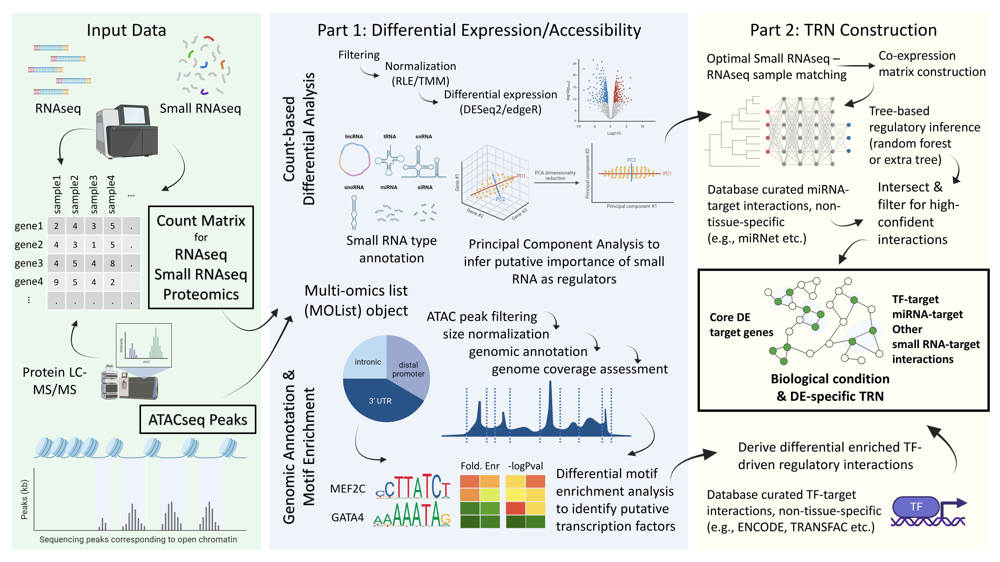

<!-- README.md is generated from README.Rmd. Please edit that file -->

# IntegraTRN

------------------------------------------------------------------------

<!-- badges: start -->

[](https://choosealicense.com/licenses/gpl-3.0/)


[](https://hub.docker.com/repository/docker/kirin26/integra_trn/general)
[](https://lifecycle.r-lib.org/articles/stages.html#stable)
<!-- badges: end -->

## Description

The R package `IntegraTRN` integrates transcriptomic, small RNAomic,
proteomic, and epigenomic data to construct a transcriptional regulatory
network (TRN) underlying the gene expression changes in a developmental
or disease (or any continuous/binary) biological context. In particular,
the TRN is a network of interacting factors, in which one element can
exert a regulatory effect (activating or inhibitory) on the expression
of one or more elements. Given the complex nature of transcriptional
regulation, the package reveals the key players of such regulation,
including transcriptional factors (TFs) and small RNAs. Since
gene/protein expression changes are usually the most direct molecular
cause of observed phenotypic alterations, the core TRN deciphers changes
between two or more conditions and infers the upstream regulatory
factors that mediate such changes. The analysis pipeline provided by
this package is primarily composed of a two-step process: (1)
elucidating the transcriptional and regulatory changes that take place
during a biological process, such as development or disease; and (2)
performing correlational analysis with rigorous filtering based on
biological data to identify the regulatory interactions that are
responsible for the observed changes.

The package is developed under the following environment:

- R version 4.3.1 (2023-06-16 ucrt)
- Platform: x86_64-w64-mingw32/x64 (64-bit)
- Running under: Windows 11 x64 (build 22621)

## Installation

To install the latest developmental version of the package:

``` r
require("devtools")
devtools::install_github("j-y26/IntegraTRN", build_vignettes = TRUE)
library("IntegraTRN")
```

To run the shinyApp:

``` r
runIntegraTRN()
```

A pre-built docker image based on Bioconductor release 3.18 is also
available for one-step installation. To install the docker image, ensure
that [Docker Desktop](https://www.docker.com/products/docker-desktop/)
has been installed on your computer. Then, run the following command in
the terminal to setup and run the container:

``` bash
docker run -e PASSWORD=changeit \
  -v ${pwd}:/home/rstudio/projects \
  -p 8787:8787 kirin26/integra_trn:v0.1.0
```

In a browser, navigate to [`localhost:8787`](http://localhost:8787) and
login with username `rstudio`.

## Overview

To browse the available function and and data in the package, as well as
the vignette tutorial, run the following commands in the R console:

``` r
ls("package:IntegraTRN")
data(package = "IntegraTRN")
browseVignettes("IntegraTRN")
```

To get started, the functionality of the package is primarily divided
into two parts: (1) exploring differential expression or accessibility
of genes and proteins, and (2) constructing a small RNA - transcription
factor - gene regulatory network. The following is an overview of the
functions in the package, in the order of use subjected to the types of
omcis data available. `IntegraTRN` provides functions:

#### Part 1 primarily consists of the following functionalities:

1.  ***MOList*** for generating a `MOList` object that contains the
    omics data and sample grouping information; the singly responsible
    function/object for handling all types of omics data
2.  ***diffOmics*** for performing differential analysis on the omics
    data
3.  ***annotateSmallRNA*** for annotating small RNA transcripts
4.  ***plotVolcano*** for visualizing differential expression results of
    count-based omics data (RNAseq, small RNAseq, and proteomics) in the
    form of volcano plots with up and down regulated genes highlighted
5.  ***plotVolcanoSmallRNA*** for visualizing small RNAseq differential
    expression, highlighted by the type of small RNA
6.  ***plotSmallRNAPCAs*** for visualizing small RNAseq principal
    component analysis for each type of small RNA
7.  ***countPCA*** for general-purpose principal component analysis on
    count data
8.  ***annotateATACPeaksMotif*** for annotating ATACseq peaks with motif
    enrichment analysis
9.  ***plotATACAnno*** for visualizing the annotation of ATACseq peaks
10. ***plotATACCoverage*** for visualizing the coverage of ATACseq peaks
11. ***plotATACMotifHeatmap*** for visualizing the motif enrichment
    analysis as a heatmap comparing differentially enriched motifs
    between the two testing conditions
12. ***exportDE***, a utility function for exporting the differential
    expression results to a data frame
13. ***as.data.frame***, a utility generic function for converting the
    `PEAKTag` object to a data frame for easy manipulation
14. ***asGRanges***, a utility generic function for converting the
    `PEAKTag` object to a `GRanges` object for easy manipulation
15. ***getRawData***, a utility function for easy access of the raw data
    stored in the `MOList` object, which is an accessor function for the
    `MOList` internal slots
16. ***exportNormalizedCounts***, a utility function for exporting the
    normalized counts after differential analysis
17. ***DETag***, a utility function as a constructor for the `DETag`
    object, useful for optimizing TRN construction workflow
18. ***TOPTag***, a utility function as a constructor for the `TOPTag`
    object, which inherits the `DETag` class with additional gene
    selection criteria and ranking, useful for optimizing TRN
    construction workflow
19. ***PEAKTag***, a utility function as a constructor for the `PEAKTag`
    object, which inherits the `DETag` class with specific peak
    annotations, useful for optimizing TRN construction workflow

#### Part 2 primarily consists of the following functionalities:

20. ***matchSamplesRNAsmallRNA*** for matching the samples between
    RNAseq and small RNAseq data
21. ***exportMatchResult*** for exporting the matching results to a data
    frame
22. ***loadExtInteractions*** for loading external interaction data for
    small RNA - gene and TF - gene interactions
23. ***setGene2Protein*** for setting the gene to protein name mapping
24. ***setOmicCutoffs*** for setting the cutoffs for differential
    expression and accessibility used to filter the key elements in the
    TRN
25. ***constructTRN*** for constructing the TRN
26. ***plotNetwork*** for visualizing the TRN
27. ***parseVertexMetadata*** for parsing the vertex metadata of the TRN
    to retrieve the key elements in the TRN
28. ***exportEdgeSet***, a utility function for exporting the edge set
    of the TRN
29. ***exportIgraph***, a utility function for exporting an `igraph`
    object of the TRN for further plot customization
30. ***writeTRN***, a utility function for exporting the TRN to a file
    in a compatible format for third-party network analysis softwares
31. ***TRNet***, a utility function as a constructor for the `TRNet`
    object, useful for optimizing TRN construction workflow if users
    simply want to visualize a network without prior analysis

#### and finally integrating the two parts into a single workflow:

32. ***runIntegraTRN*** for running a shinyApp that integrates the two
    parts into a user-friendly single workflow

<br>

For detailed information on the analysis pipeline, please refer to the
package vignette

- [`Integrating multi-omics for constructing transcriptional regulatory networks`](https://htmlpreview.github.io/?https://raw.githubusercontent.com/j-y26/IntegraTRN-Docker/main/doc/Integrating_multi-omics_for_constructing_transcription_regulatory_networks.html)

and workflow optimization information, please refer to the package
vignette

- [`Optimizing workflows for TRN construction`](https://htmlpreview.github.io/?https://raw.githubusercontent.com/j-y26/IntegraTRN-Docker/main/doc/Optimizing_workflows_for_TRN_construction.html)

<br>

The package also provides several datasets:

- An RNAseq count matrix: `RNAseq_heart`

- A small RNAseq count matrix covering miRNA, tRNA, piRNA, snoRNA,
  snRNA, and circRNA: `smallRNAseq_heart`

- A proteomics count matrix: `protein_heart`

- Sample information for all above 3 omics data: `RNAseq_heart_samples`,
  `smallRNAseq_heart_samples`, and `protein_heart_samples`

- Two ATACseq peak files as raw data located in the `extdata` folder:
  `peak1.bed` and `peak2.bed`

- An example miRNA-gene interaction dataset: `miR2Genes`

- An example TF-gene interaction dataset: `tf2Genes`

- An example protein-gene name conversion information:
  `proteinGeneIDConvert`

- Position weight matrix (PWM) for vertebrate DNA binding motifs curated
  by the JASPAR database 2022 release: `jasparVertebratePWM`

- Small RNA type annotation for human small RNA transcripts:
  `sncRNAAnnotation`

- An example MOList object containing all types of omics data, but with
  a very light weight (100 genes only)

Please refer to the package vignette
`Integrating multi-omics for constructing transcriptional regulatory networks`
for more details on these datasets and the illustration of the analysis
pipeline.

The package has also defined a set of key data structures, namely the S4
classes `MOList`, `DETag`, `TOPTag`, `PEAKTag`, and `TRNet`. Please
refer to the package vignette
`Optimizing workflows for TRN construction` for more details on these
data structures and how to use them effectively to extend the
functionality of the package.

An overview of the analysis pipeline is shown below:

<figure>

<figcaption aria-hidden="true">Overview of the package analysis pipeline
(figure created from BioRender.com)</figcaption>
</figure>

## Contributions

The author of the package is Jielin Yang. The author defined all data
structures used in this package, including the S4 classes `MOList`,
`DETag`, `TOPTag`, `PEAKTag`, and `TRNet`. The author wrote the `MOList`
function to construct the key data structure and performs validations on
the input omics data. The function `diffOmics` performs differential
expression on RNAseq, small RNAseq, and proteomics data using a negative
binomial model, which internally normalizes and performs differential
analysis using the `DESeq2` or `edgeR` package. ATACseq peaks are
handled as genomic coordinates using the `GenomicRanges` package. The
author wrote the `annotateSmallRNA` function to annotate small RNA
transcripts. The three plotting functions, `plotVolcanoRNA`,
`plotVolcanoSmallRNA`, and `plotSmallRNAPCAs`, are supported by the
`ggplot2` package, with PCA analysis supported by `DESeq2` on normalized
expression. The `ChIPseeker` package is used to annotate ATACseq peaks
with motif enrichment analysis and performs plotting on ATACseq peaks.
The `matchSamplesRNAsmallRNA` function performs optimal matching based
on mahalanobis distance between the sample information of the RNAseq and
small RNAseq data. The calculation of the mahalanobis distance and
selection of optimal pairs are supported by the `MatchIt` package. The
author wrote the utility functions `exportMatchResult` and
`loadExtInteractions` to export the matching results and load external
interaction data. The author also wrote the `setOmicCutoffs` function as
an easy way for the users to decide on the inclusion criteria for the
key elements in the TRN. The author wrote the `constructTRN` function,
with a logic defined to integrate the different omics data depending on
their availability, as well as whether predicted inference is used. The
inference of predicted small RNA - gene interactions is supported by the
author’s discretion to generate a single coherent normalized expression
matrix for both RNAseq and small RNAseq data that allows co-expression
estimation. The inference of small RNA - gene interactions is performed
by the `GENIE3` package, which internally uses a three-based algorithm
to infer the interactions. The author designed the method for predicted
inference of small RNA - gene interactions based on two separate omic
dataset. The `igraph` package is used to visualize the TRN, with
interactive support provided by the `networkD3` package. Most data frame
processing used internally in the functions is supported by the `dplyr`
package. Generative AI tool was used to generate some unit test example
data based on the author’s description. Generative AI results were
incorporated into the tests at the author’s discretion. The packages
`shiny`, `shinyBS`, and `DT` were used to implement with UI for the
shinyApp. The author designed the shinyApp UI and logic and optimized
the workflow for the shinyApp. In brief, with support of the above
packages for separate functionalities, the author pioneered the analysis
pipeline that integrates the different omics data and the logic for TRN
inference and visualization with different levels of data integration.
The author also pre-compile the package for the Docker image.

## References

<div id="refs" class="references csl-bib-body hanging-indent">

<div id="ref-adar2023integrate" class="csl-entry">

Aharon-Yariv, Adar, Yaxu Wang, Abdalla Ahmed, and Paul Delgado-Olguı́n.
2023. “Integrated Small RNA, mRNA and Protein Omics Reveal a miRNA
Network Orchestrating Metabolic Maturation of the Developing Human
Heart.” *BMC Genomics* 24 (1): 1–18.

</div>

<div id="ref-shinyBS" class="csl-entry">

Bailey, Eric. 2022. *shinyBS: Twitter Bootstrap Components for Shiny*.
<https://CRAN.R-project.org/package=shinyBS>.

</div>

<div id="ref-chang2020mirnet" class="csl-entry">

Chang, Le, Guangyan Zhou, Othman Soufan, and Jianguo Xia. 2020. “miRNet
2.0: Network-Based Visual Analytics for miRNA Functional Analysis and
Systems Biology.” *Nucleic Acids Research* 48 (W1): W244–51.

</div>

<div id="ref-shiny" class="csl-entry">

Chang, Winston, Joe Cheng, JJ Allaire, Carson Sievert, Barret Schloerke,
Yihui Xie, Jeff Allen, Jonathan McPherson, Alan Dipert, and Barbara
Borges. 2023. *Shiny: Web Application Framework for r*.
<https://CRAN.R-project.org/package=shiny>.

</div>

<div id="ref-csardi2006igraph" class="csl-entry">

Csardi, Gabor, Tamas Nepusz, et al. 2006. “The Igraph Software Package
for Complex Network Research.” *InterJournal, Complex Systems* 1695 (5):
1–9.

</div>

<div id="ref-huynh2010inferring" class="csl-entry">

Huynh-Thu, Vân Anh, Alexandre Irrthum, Louis Wehenkel, and Pierre
Geurts. 2010. “Inferring Regulatory Networks from Expression Data Using
Tree-Based Methods.” *PloS One* 5 (9): e12776.

</div>

<div id="ref-lawrence2013software" class="csl-entry">

Lawrence, Michael, Wolfgang Huber, Hervé Pagès, Patrick Aboyoun, Marc
Carlson, Robert Gentleman, Martin T Morgan, and Vincent J Carey. 2013.
“Software for Computing and Annotating Genomic Ranges.” *PLoS
Computational Biology* 9 (8): e1003118.

</div>

<div id="ref-love2014moderated" class="csl-entry">

Love, Michael I, Wolfgang Huber, and Simon Anders. 2014. “Moderated
Estimation of Fold Change and Dispersion for RNA-Seq Data with DESeq2.”
*Genome Biology* 15 (12): 1–21.

</div>

<div id="ref-machlab2022monalisa" class="csl-entry">

Machlab, Dania, Lukas Burger, Charlotte Soneson, Filippo M Rijli, Dirk
Schübeler, and Michael B Stadler. 2022. “monaLisa: An r/Bioconductor
Package for Identifying Regulatory Motifs.” *Bioinformatics* 38 (9):
2624–25.

</div>

<div id="ref-styler" class="csl-entry">

Müller, Kirill, and Lorenz Walthert. 2023. *Styler: Non-Invasive Pretty
Printing of r Code*. <https://CRAN.R-project.org/package=styler>.

</div>

<div id="ref-R" class="csl-entry">

R Core Team. 2023. *R: A Language and Environment for Statistical
Computing*. Vienna, Austria: R Foundation for Statistical Computing.
<https://www.R-project.org/>.

</div>

<div id="ref-robinson2010edger" class="csl-entry">

Robinson, Mark D, Davis J McCarthy, and Gordon K Smyth. 2010. “edgeR: A
Bioconductor Package for Differential Expression Analysis of Digital
Gene Expression Data.” *Bioinformatics* 26 (1): 139–40.

</div>

<div id="ref-stuart2011matchit" class="csl-entry">

Stuart, Elizabeth A, Gary King, Kosuke Imai, and Daniel Ho. 2011.
“MatchIt: Nonparametric Preprocessing for Parametric Causal Inference.”
*Journal of Statistical Software*.

</div>

<div id="ref-villanueva2019ggplot2" class="csl-entry">

Villanueva, Randle Aaron M, and Zhuo Job Chen. 2019. “Ggplot2: Elegant
Graphics for Data Analysis.” Taylor & Francis.

</div>

<div id="ref-dplyr" class="csl-entry">

Wickham, Hadley, Romain François, Lionel Henry, Kirill Müller, and Davis
Vaughan. 2023. *Dplyr: A Grammar of Data Manipulation*.
<https://CRAN.R-project.org/package=dplyr>.

</div>

<div id="ref-DT" class="csl-entry">

Xie, Yihui, Joe Cheng, and Xianying Tan. 2023. *DT: A Wrapper of the
JavaScript Library ’DataTables’*.
<https://CRAN.R-project.org/package=DT>.

</div>

<div id="ref-yu2015chipseeker" class="csl-entry">

Yu, Guangchuang, Li-Gen Wang, and Qing-Yu He. 2015. “ChIPseeker: An
r/Bioconductor Package for ChIP Peak Annotation, Comparison and
Visualization.” *Bioinformatics* 31 (14): 2382–83.

</div>

</div>

## Acknowledgements

This package was developed as part of an assessment for 2023 BCB410H:
Applied Bioinformatics course at the University of Toronto, Toronto,
CANADA. `IntegraTRN` welcomes issues, enhancement requests, and other
contributions. To submit an issue, use the [GitHub
issues](https://github.com/j-y26/IntegraTRN/issues).

## Author’s note

### Bioconductor version

A recent version of Bioconductor release is recommended. The author used
Bioconductor 3.18 for the development of this package.

To set Bioconductor version:

``` r
BiocManager::install(version = "3.18") # or another recent version
```

### Building the package locally

Users are encouraged to clone the repository locally to build the
package. However, when running `R CMD` check using `devtools::check()`,
one warning is expected:

    Requires (indirectly) orphaned package: 'plotrix'

This is due to the `plotrix` package being orphaned, which is imported
by one of the package dependency, `ChIPseeker`.

According to
[CRAN](https://cran.r-project.org/web/packages/plotrix/index.html),
which is updated on Nov. 10, 2023, the `plotrix` package is orphaned.
The the maintainer of the `plotrix` package has passed away, and the
package is current searching for a new maintainer. Since `ChIPseeker`
presents a core functionality of `IntegraTRN` and that the `plotrix`
package has been stable for an extended period, the recent change on the
status of `plotrix` should not affect the functionality of `IntegraTRN`.
Hence, the warning can be safely ignored.

Any suggestions or comments on this issue are welcome.
